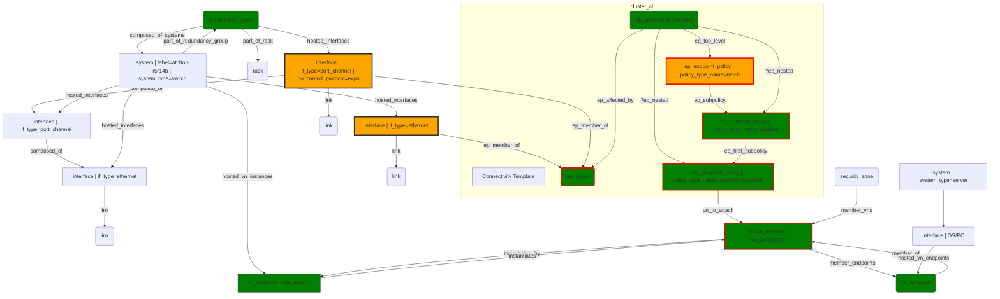

```mermaid

graph TB
    subgraph cluster_ct
        label["Connectivity Template"]
        EG("ep_group"):::green
        EPI("ep_application_instance"):::green
        EEPB["ep_endpoint_policy | policy_type_name=batch"]:::orange
        EEPP["ep_endpoint_policy | policy_type_name=pipeline"]:::green
        EEPS["ep_endpoint_policy | policy_type_name=AttachSingleVLAN"]:::green
    end

    RACK("rack")
    RG("redundancy_group"):::green
    Switch["system | label=atl1tor-r5r14b | system_type=switch"]
    IF_evpn["interface | if_type=port_channel | po_control_protocol=evpn"]:::orange
    IF_eth["interface | if_type=ethernet"]:::orange
    IF_member["interface | if_type=ethernet"]
    IF_ae["interface | if_type=port_channel"]
    LINK_evpn("link")
    LINK_ethernet("link")
    LINK_member("link")
    IF_GS_PC["interface | GS/PC"]
    SS["system | system_type=server"]
    VN["virtual_network | vn_id=100121"]:::green
    VE("vn_endpoint"):::green
    VI["vn_instance | vlan_id=121"]:::green
    SZ("security_zone")

    RG -->|part_of_rack| RACK
    RG -->|composed_of_systems| Switch
    RG -->|hosted_interfaces| IF_evpn
    Switch -->|hosted_vn_instances| VI

    IF_eth -->|ep_member_of| EG:::red
    IF_evpn -->|ep_member_of| EG:::red
    EEPB -->|ep_subpolicy| EEPP:::red
    EPI -->|ep_top_level| EEPB:::red
    EPI -->|ep_affected_by| EG:::red
    EPI -->|?ep_nested| EEPP
    EPI -->|?ep_nested| EEPS
    EEPP -->|ep_first_subpolicy| EEPS:::red
    EEPS -->|vn_to_attach| VN:::red
    VN -->|member_endpoints| VE
    VN -->|instantiated_by| VI
    SZ -->|member_vns| VN
    VE -->|member_of| VN
    IF_GS_PC -->|hosted_vn_endpoints| VE
    SS --> IF_GS_PC
    VI -->|instantiates| VN
    IF_evpn -->|composed_of| IF_ae
    IF_ae -->|composed_of| IF_member
    IF_member -->|link| LINK_member
    IF_eth -->|link| LINK_ethernet
    IF_evpn -->|link| LINK_evpn
    Switch -->|hosted_interfaces| IF_eth
    Switch -->|part_of_redundancy_group| RG
    Switch -->|hosted_interfaces| IF_ae
    Switch -->|hosted_interfaces| IF_member

    classDef green fill:green,stroke:#333,stroke-width:1px;
    classDef orange fill:orange,stroke:#333,stroke-width:3px;
    classDef red stroke:red,stroke-width:3px;

```
