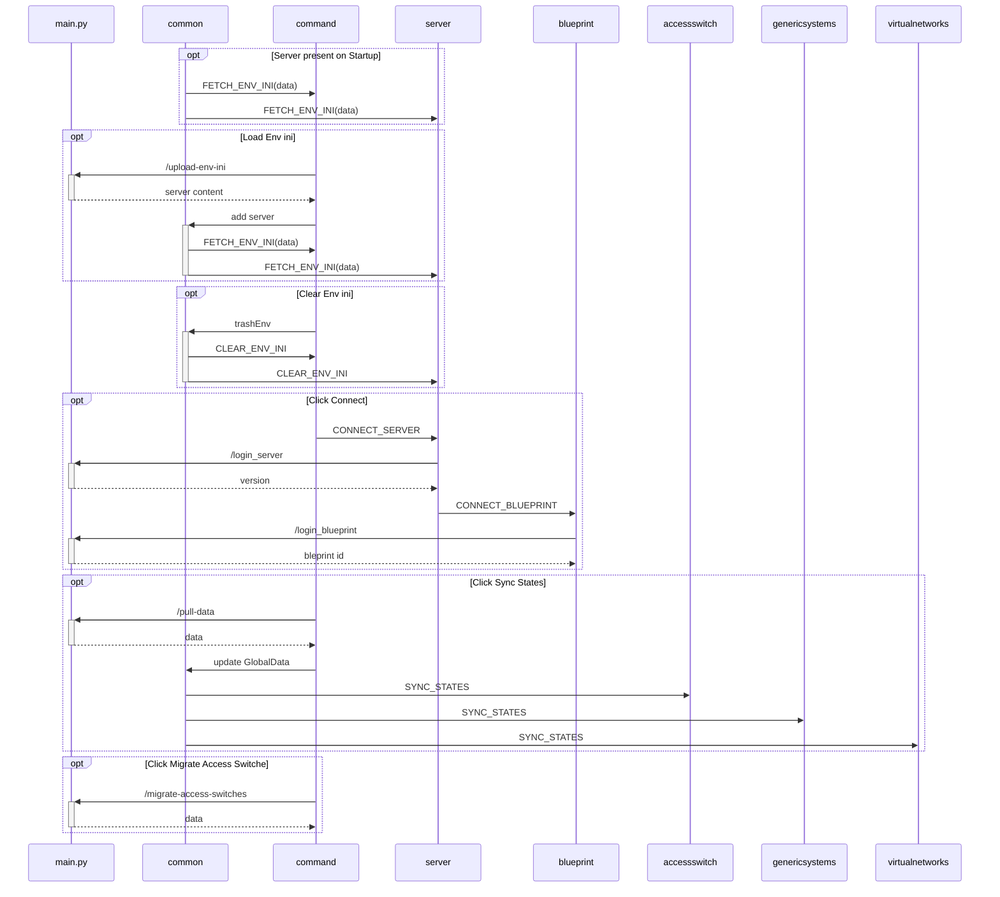

```mermaid
sequenceDiagram
    participant main.py
    participant common
    participant command
    participant server
    participant blueprint
    participant accessswitch
    participant genericsystems

    opt Server present on Startup
        common ->> command: FETCH_ENV_INI(data)
        common ->> server: FETCH_ENV_INI(data)
    end
    opt Load Env ini
        command ->> +main.py: /upload-env-ini
        main.py -->> -command: server content
        command ->> +common: add server
        common ->> command: FETCH_ENV_INI(data)
        common ->> -server: FETCH_ENV_INI(data)
    end
    opt Clear Env ini
        command ->> +common: trashEnv
        common ->> command: CLEAR_ENV_INI
        common ->> -server: CLEAR_ENV_INI
    end
    opt Click Connect
        command ->> server: CONNECT_SERVER
        server ->> +main.py: /login_server
        main.py -->> -server: version
        server ->> blueprint: CONNECT_BLUEPRINT
        blueprint ->> +main.py: /login_blueprint
        main.py -->> -blueprint: bleprint id
    end
    opt Click Sync States
        command ->> +main.py: /pull-data
        main.py -->> -command: data
        command ->> common: update GlobalData
        common ->> accessswitch: SYNC_STATES
        common ->> genericsystems: SYNC_STATES
        common ->> virtualnetworks: SYNC_STATES

    end
    opt Click Migrate Access Switche
        command ->>+main.py: /migrate-access-switches
        main.py -->> -command: data
    end
```
