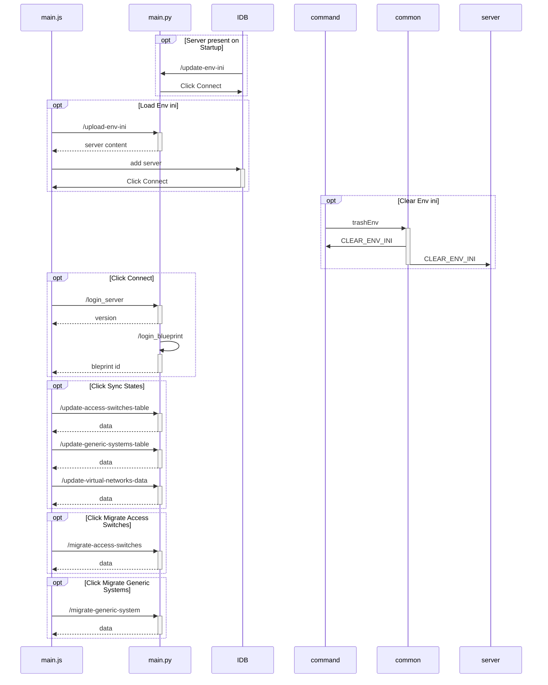

```mermaid
sequenceDiagram
    participant main.js
    participant main.py

    opt Server present on Startup
        IDB ->> main.py: /update-env-ini
        main.py ->> IDB: Click Connect
    end
    opt Load Env ini
        main.js ->> +main.py: /upload-env-ini
        main.py -->> -main.js: server content
        main.js ->> +IDB: add server
        IDB ->> -main.js: Click Connect
    end
    opt Clear Env ini
        command ->> +common: trashEnv
        common ->> command: CLEAR_ENV_INI
        common ->> -server: CLEAR_ENV_INI
    end

    opt Click Connect
        main.js ->> +main.py: /login_server
        main.py -->> -main.js: version
        main.py ->> +main.py: /login_blueprint
        main.py -->> -main.js: bleprint id
    end

    opt Click Sync States
        main.js ->> +main.py: /update-access-switches-table
        main.py -->> -main.js: data
        main.js ->> +main.py: /update-generic-systems-table
        main.py -->> -main.js: data
        main.js ->> +main.py: /update-virtual-networks-data
        main.py -->> -main.js: data
    end

    opt Click Migrate Access Switches
        main.js ->>+main.py: /migrate-access-switches
        main.py -->> -main.js: data
    end

    opt Click Migrate Generic Systems
        main.js ->>+main.py: /migrate-generic-system
        main.py -->> -main.js: data
    end
```
