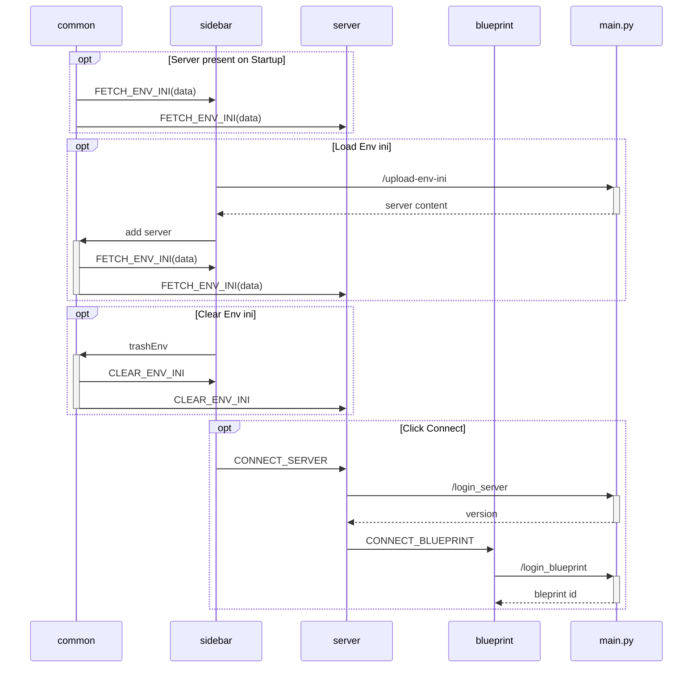

```mermaid
sequenceDiagram
    participant common
    participant sidebar
    participant server
    participant blueprint
    participant main.py

    opt Server present on Startup
        common ->> sidebar: FETCH_ENV_INI(data)
        common ->> server: FETCH_ENV_INI(data)
    end
    opt Load Env ini
        sidebar ->> +main.py: /upload-env-ini
        main.py -->> -sidebar: server content
        sidebar ->> +common: add server
        common ->> sidebar: FETCH_ENV_INI(data)
        common ->> -server: FETCH_ENV_INI(data)
    end
    opt Clear Env ini
        sidebar ->> +common: trashEnv
        common ->> sidebar: CLEAR_ENV_INI
        common ->> -server: CLEAR_ENV_INI
    end
    opt Click Connect
        sidebar ->> server: CONNECT_SERVER
        server ->> +main.py: /login_server
        main.py -->> -server: version
        server ->> blueprint: CONNECT_BLUEPRINT
        blueprint ->> +main.py: /login_blueprint
        main.py -->> -blueprint: bleprint id
    end

```
