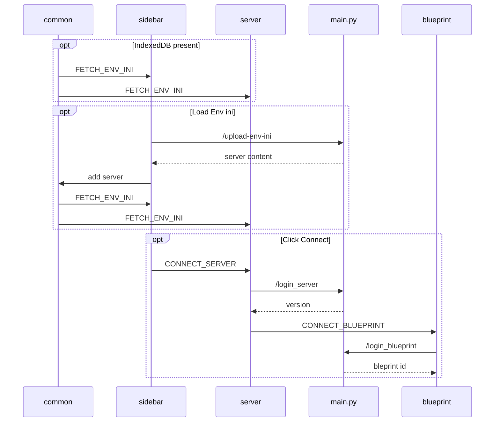

```mermaid
sequenceDiagram

    opt IndexedDB present   
        common ->> sidebar: FETCH_ENV_INI
        common ->> server: FETCH_ENV_INI
    end
    opt Load Env ini
        sidebar ->> main.py: /upload-env-ini
        main.py -->> sidebar: server content
        sidebar ->> common: add server
        common ->> sidebar: FETCH_ENV_INI
        common ->> server: FETCH_ENV_INI
    end
    opt Click Connect
        sidebar ->> server: CONNECT_SERVER
        server ->> main.py: /login_server
        main.py -->> server: version
        server ->> blueprint: CONNECT_BLUEPRINT
        blueprint ->> main.py: /login_blueprint
        main.py -->> blueprint: bleprint id
    end

```
