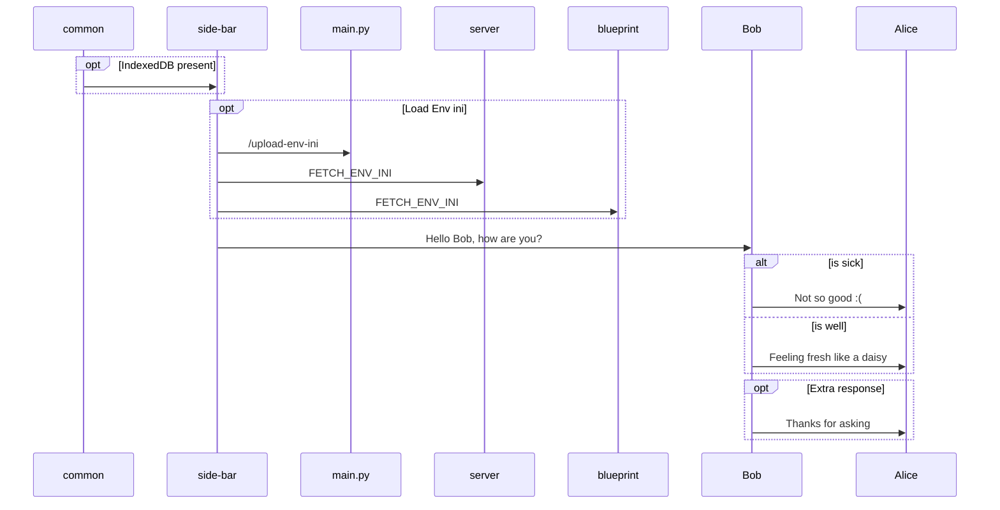

```mermaid
sequenceDiagram

    opt IndexedDB present   
        common ->> side-bar:  
    end
    opt Load Env ini
        side-bar ->> main.py: /upload-env-ini
        side-bar ->> server: FETCH_ENV_INI
        side-bar ->> blueprint: FETCH_ENV_INI
    end
    side-bar->>Bob: Hello Bob, how are you?
    alt is sick
        Bob->>Alice: Not so good :(
    else is well
        Bob->>Alice: Feeling fresh like a daisy
    end
    opt Extra response
        Bob->>Alice: Thanks for asking
    end

```
